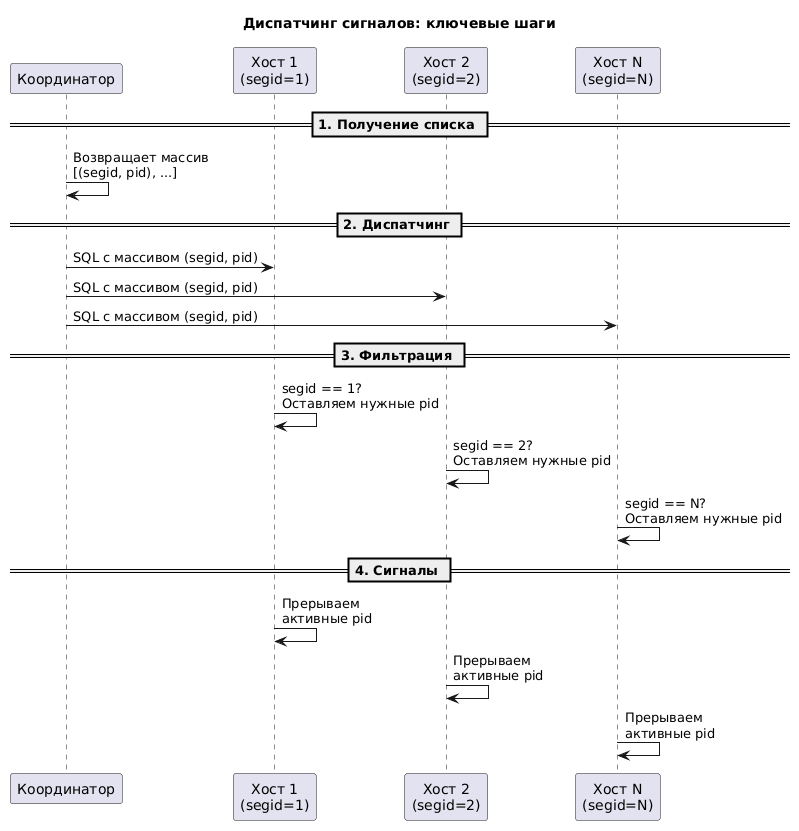
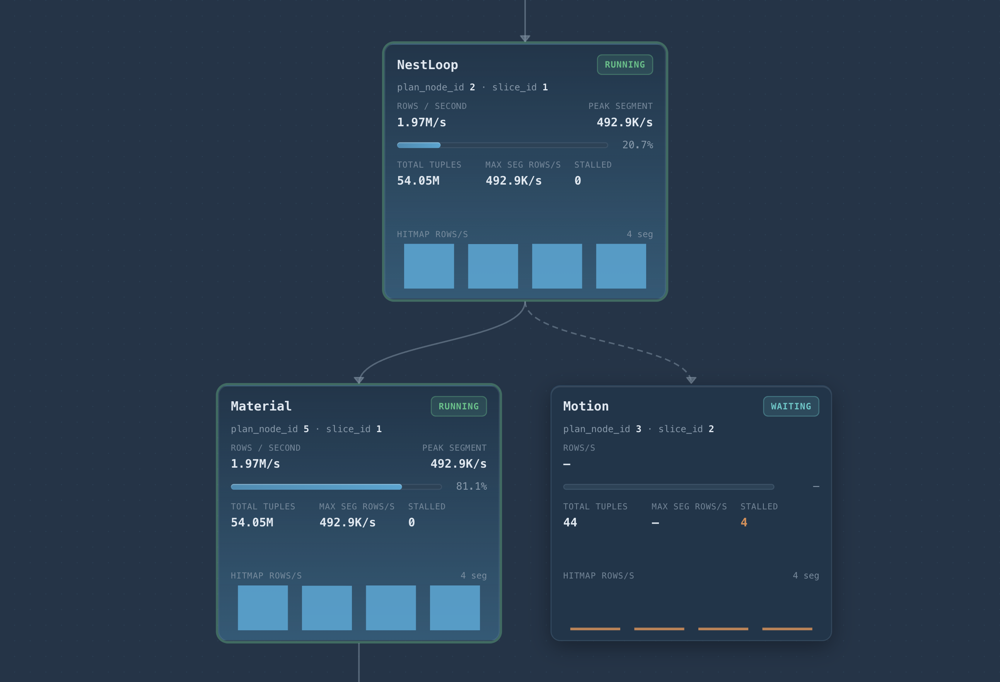
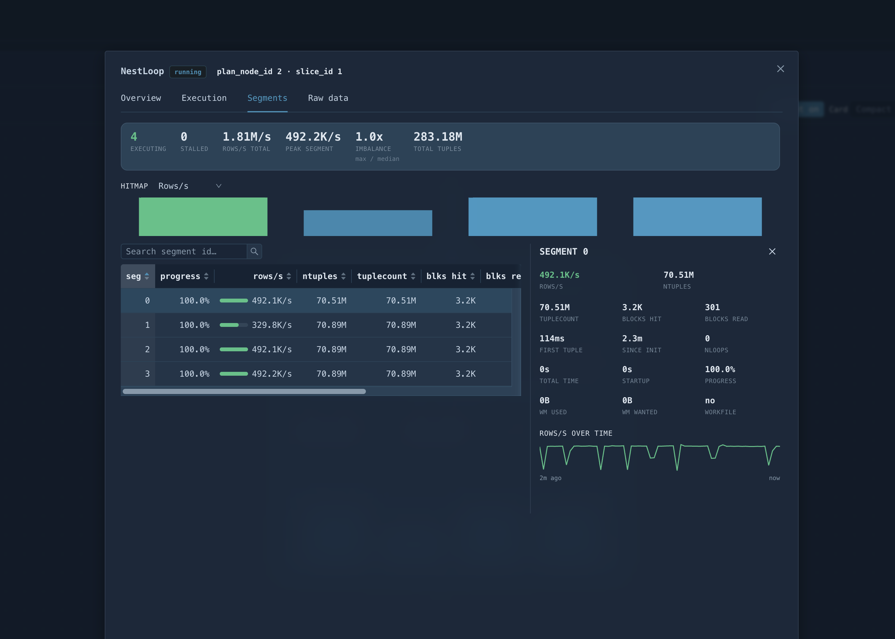

# YAGPCC 2.0 — Yet Another Greenplum Command Center

> Карточка: `02-yagpcc-2.0.pdf`

## Проблема

`EXPLAIN` показывает план до выполнения. `EXPLAIN ANALYZE` — после. А что
происходит с запросом, который идёт уже двадцать минут? Классический ответ —
ждать и гадать: на каком узле он стоит, все ли сегменты работают, есть ли перекос
данных, стоит ли его убивать или он вот-вот закончится.

## Что сделали

YAGPCC 2.0 — интерфейс наблюдения и управления кластером Cloudberry.

**Дашборды по состоянию:**

- хостов,
- сессий,
- запросов.

**Работа с запросами:**

- метрики, текст и план запроса,
- статистика выполнения звапроса из procfs,
- визуальный live-план выполнения,
- kill и смена ресурсной группы на лету.

Новая фича — **прогресс плана выполнения в реальном времени**.

## Стенд: создаём таблицы

```sql
CREATE TABLE test (
    id      serial primary key,
    val     numeric,
    txt     text,
    created timestamp default now()
);

INSERT INTO test (val, txt)
SELECT g % 1000, repeat('x', 100)
FROM generate_series(1, 5000000) g;

-- маленькая таблица-справочник, чтобы получить многоуровневый план
CREATE TABLE dim (id int, label text) DISTRIBUTED REPLICATED;
INSERT INTO dim SELECT g, 'label_' || g FROM generate_series(1, 64) g;

ANALYZE test;
ANALYZE dim;
```

Чтобы было что разглядывать в live-плане, нужен запрос, который живёт хотя бы
десяток секунд. Подойдёт `NestLoop` над пятью миллионами строк:

```sql
SET enable_hashjoin = off;

SELECT d.label, count(*)
FROM test t, dim d
WHERE t.val > d.id
GROUP BY d.label
ORDER BY 1;
```

Запустите его в одной сессии и откройте её в YAGPCC — план будет
перерисовываться по мере выполнения.

### Как найти запрос

1. Откройте в брайзере UI - http://localhost:1431
2. Перейдите в список сессий и найдите вашу сессию (DBeaver соединяется от gpuser)
3. Откройте ее, будет много деталей. Внизу страницы будет список выполняемых запросов
4. Откройте текущий выполняемый запрос
5. На вкладке "План выполнения" будет и план и его прогесс

## Как это устроено

Напомним, что такое слайс. Слайс (slice) — горизонтальный срез плана,
ограниченный точками обмена данными (Motion-узлами). Оптимизатор разбивает
распределённый план на слайсы: каждый выполняется параллельно на всех сегментах
в рамках своего процесса QE (Query Executor). Внутри слайса сегменты работают
независимо, обрабатывая только свои локальные данные, а результаты передаются
между слайсами через Motion-узлы (`Gather`, `Redistribute`, `Broadcast`).

```
postgres=# explain select * from test a where a.val > 10;
                                   QUERY PLAN
 Gather Motion 4:1  (slice1; segments: 4)  (cost=0.00..1620.53 rows=4999950 width=57)
   ->  Seq Scan on test a  (cost=0.00..667.21 rows=1249988 width=57)
         Filter: (val > '10'::numeric)
 Optimizer: GPORCA
```

Чтобы собрать статистику **во время** выполнения, нужно снять её на каждом
активном процессе и куда-то отправить. Сегменты и координатор — это процессы,
которые физически живут на разных машинах, поэтому обычные сигналы прерывания
(как в локальном PostgreSQL) не работают.

Решение — использовать механизм диспатчинга SQL-команд:

1. отправляем сигнал координатору, он возвращает массив пар `(segid, pid)`
   для всех активных сегментов;
2. запускаем на всех сегментах SQL-запрос, аргументом которого выступает этот
   массив;
3. внутри сегмента порождается отдельный процесс, который фильтрует нужные пары
   (`segid` должен совпасть с текущим сегментом);
4. локальный бэкенд рассылает сигналы всем активным процессам в пределах своего
   сегмент-хоста.

Так мы прерываем все нужные процессы прямо с координатора.



## Результат

Дерево плана выполнения с прогрессом в реальном времени по каждому узлу:
статус (`INIT` / `RUNNING` / `WAITING` / `DONE`), rows/s, суммарное число
кортежей, число «залипших» (stalled) сегментов и хитмап по сегментам.



Любой узел раскрывается до детализации по сегментам — там видно распределение
rows/s, прогресс каждого сегмента, показатель перекоса (`imbalance = max/median`),
блоки, work_mem, использование workfile и график rows/s во времени.



## Вывод

Перекос данных, зависший Motion, сегмент-аутсайдер — всё это перестаёт быть
предметом догадок. Запрос виден вживую, и по нему можно принять решение:
подождать, переложить в другую ресурсную группу или убить.
