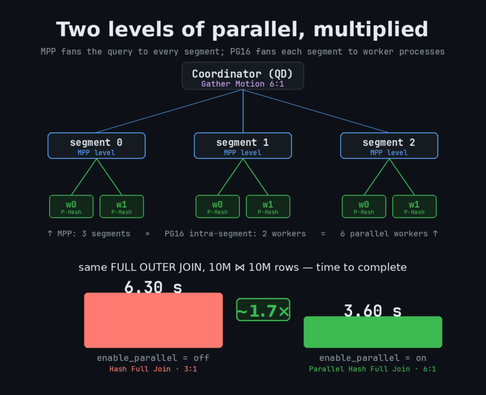
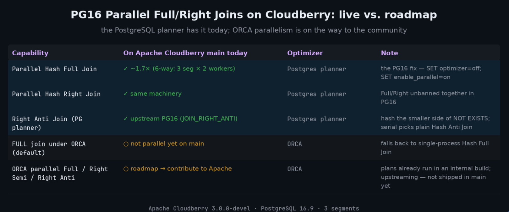

# Parallel join — два уровня параллелизма

> Карточка: `04-parallel-join.pdf`

## Идея

У MPP-движка выполнение запроса параллелится по сегментам. У PostgreSQL16 запрос параллелится по воркерам. А давайте
эти два уровня параллелизма совместим:

- **MPP-уровень**: движок выполняет запрос на каждом сегменте - параллелим запрос по хостам;
- **внутрисегментный уровень**: PG16 запускает несколько worker-процессов
  для каждого процесса сегмента - параллелим выполнение на одном хосте.

Получаем 3 сегмента × 2 worker'а = 6 параллельных исполнителей, и `Gather Motion 6:1`
на координаторе вместо `3:1`.

Картинка для илююстрации идеи:



Отдельно важен сам PG16: в нём сняли запрет на параллельные `FULL` и `RIGHT`
hash join'ы (и добавили `JOIN_RIGHT_ANTI`). До этого такие join'ы всегда
выполнялись одним процессом на сегмент.

## Стенд: создаём таблицы

Две таблицы по 10 млн строк, распределённые по `id`, с частично
пересекающимися диапазонами ключей — чтобы `FULL OUTER JOIN` дал работу
обеим сторонам:

```sql
CREATE TABLE f_left  (id int, pad text) DISTRIBUTED BY (id);
CREATE TABLE f_right (id int, pad text) DISTRIBUTED BY (id);

INSERT INTO f_left  SELECT g,           repeat('l', 40) FROM generate_series(1,        10000000) g;
INSERT INTO f_right SELECT g + 5000000, repeat('r', 40) FROM generate_series(1,        10000000) g;

ANALYZE f_left;
ANALYZE f_right;
```

Запрос и переключатели:

```sql
SET optimizer = off;                     -- параллельные FULL/RIGHT — под Postgres planner
SET max_parallel_workers_per_gather = 8;

SET enable_parallel = on;                -- или off

EXPLAIN ANALYZE
SELECT count(*) FROM f_left l FULL OUTER JOIN f_right r ON l.id = r.id;
```

Замеры с карточки сняты на стенде из 3 сегментов — соответственно `3:1`
без параллелизма и `6:1` с ним.

## Цифры

Одинаковый `FULL OUTER JOIN`, 10 млн × 10 млн строк:

| | `enable_parallel = off` | `enable_parallel = on` |
|---|---|---|
| План | `Hash Full Join` · 3:1 | `Parallel Hash Full Join` · 6:1 |
| Время | **6.30 s** | **3.60 s** |

Ускорение — **~1.7×**.

## Ещё пример: обычный INNER JOIN

Параллелизм помогает не только на `FULL OUTER`. Большая probe-сторона
и маленькая build-сторона:

```sql
CREATE TABLE p_probe (id int, pad text) DISTRIBUTED BY (id);
CREATE TABLE p_build (id int, v   text) DISTRIBUTED BY (id);
INSERT INTO p_probe SELECT g, repeat('x', 200) FROM generate_series(1, 2000000) g;
INSERT INTO p_build SELECT g, 'b' || g        FROM generate_series(1, 5000) g;
ANALYZE p_probe; ANALYZE p_build;

SELECT b.v, p.id FROM p_probe p JOIN p_build b ON p.id = b.id;
```

| Настройка | План | Execution Time |
|---|---|---|
| `enable_parallel = off` | `Gather Motion 2:1`, `Seq Scan` | 551 ms |
| `enable_parallel = on`, Postgres planner | `Gather Motion 8:1`, `Parallel Seq Scan` | 242 ms |
| `enable_parallel = on`, GPORCA | `Gather Motion 16:1`, `Parallel Seq Scan` | 167 ms |

Ключевая строчка в плане — `Parallel Seq Scan` под `Hash Join` и увеличившийся
знаменатель у `Gather Motion`:

```
 Gather Motion 16:1  (slice1; segments: 16)  (actual time=11.965..142.310 rows=5000 loops=1)
   ->  Hash Join  (actual time=11.072..133.499 rows=246 loops=1)
         Hash Cond: (p.id = b.id)
         ->  Parallel Seq Scan on p_probe p  (actual time=0.074..57.005 rows=144486 loops=1)
         ->  Hash  (actual time=2.126..2.127 rows=5000 loops=1)
               ->  Broadcast Motion 16:16  (slice2; segments: 16)  (actual time=0.047..0.915 rows=5000 loops=1)
                     ->  Parallel Seq Scan on p_build b
 Optimizer: GPORCA
 Execution Time: 166.964 ms
```

Включается так:

```sql
SET enable_parallel = on;
SET max_parallel_workers_per_gather = 8;
```

## Что уже есть, а что в планах



| Возможность | Статус в Apache Cloudberry main | Оптимизатор |
|---|---|---|
| Parallel Hash Full Join | ✅ ~1.7× (6-way: 3 seg × 2 workers) | Postgres planner |
| Parallel Hash Right Join | ✅ та же механика | Postgres planner |
| Right Anti Join (`JOIN_RIGHT_ANTI`) | ✅ из upstream PG16 | Postgres planner |
| FULL join под ORCA (по умолчанию) | ⭕ пока не параллельный — откат на однопроцессный `Hash Full Join` | GPORCA |
| ORCA parallel Full / Right Semi / Right Anti | ⭕ roadmap, готовим контрибьют в Apache | GPORCA |

Стенд: Apache Cloudberry 3.0.0-devel, PostgreSQL 16.9, 3 сегмента.
Чтобы получить параллельный `FULL`/`RIGHT` сегодня: `SET optimizer = off;
SET enable_parallel = on;`.

Подробнее о фиксе в PG16 — [разбор Max Yang](https://www.linkedin.com/pulse/postgresql-16s-parallel-hash-full-join-apache-cloudberry-max-yang-7ftbc/).

Обратите внимание, что в GPORCA и Postgres Optimizer параллелизм работает по-разному.

## Вывод

MPP-параллелизм по сегментам упирается в количество сегментов. Внутрисегментный
параллелизм PG16 умножает его на число worker'ов — та же железка, тот же запрос,
почти вдвое меньше времени. Под ORCA параллельные Full/Right join'ы пока в работе,
и мы несём их в апстрим.
